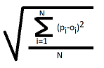

# techml
Technical notes and machine learning scripts written in various programming languages.

## Technical Notes

### Objective-C selectors and the 2 argument calling limit
Selectors in Objective-C support a very dynamic programming model.  This programming construct make it possible to check at runtime if specific methods are implemented.  Method lookup is very useful for handling code compatiblity between components that may be loosely connected.  Selectors invokation though, comes with a restriction of only allowing two parameters.  See the following [technote](macOS/objcselectors/README.md) on how to work around this limitation.

## Machine Learning

### Running Tensorflow DirectML on AMD Hardware
A small [example](ml/directml/testconv2dformats.py) that demonstrates how to run the [DirectML version of TensorFlow](https://docs.microsoft.com/en-us/windows/win32/direct3d12/gpu-tensorflow-windows) on AMD GPUs.  Use the DirectML link to learn how setup your Python and Tensorflow modules.  Code is for generic simple convolution and is a good starting point for working with an AMD GPU. 

### Root Mean Square Error (RMSE)
In datascience, RMSE is used to find the error between predicted and observed values.  Given n predicted and observed values, you find the result of the following:

This error calculation is also useful in areas such as machine learning.  Comparing the RMSE of an algorithm run on the CPU versus GPU can be used to get a handle on accurracy.
Here is a simple [example](ml/rmse/rmse.py) that demonstrates the use of RMSE. A package like numpy will allow you to calculate RMSE in a few lines.

### Virtual GPU in Python
It is an understatement to say that working with machine learning algorithms is complex.  I have found it useful to prototype various pieces of functionality in Python even before going to the shading language.  This example takes prototyping a step further and allows the simulation of a virtual GPU in Python running compute shaders.  Required objects such as Devices, Command Buffers, Buffers, Encoders and Compute Shaders can be implemented for simple GPGPU workflows.  Prototyping of GPU algorithms can be mocked up and run with the virtual GPU to aid learning/understanding and also to move work earlier in the development cycle. There are two Python files:

* [mgpu - main samples ](ml/vgpu/mgpu.py)
* [vgpu - a virtual GPU](ml/vgpu/vgpu.py)

